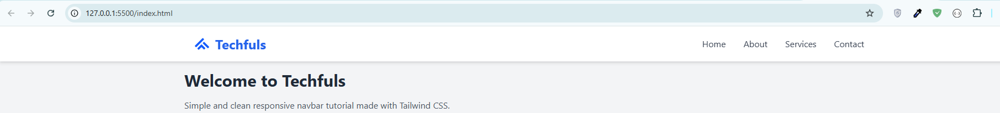

# 🌐 Responsive Tailwind Navigation

[](https://tailwindcss.com/)
[](LICENSE)
[](#preview)

A simple, elegant, and fully responsive navigation bar built with **Tailwind CSS** and **Vanilla HTML/JS**. Perfect for any website, landing page, or portfolio needing a clean and modern navbar.

---

## ✨ Features

- ✅ Mobile-first responsive layout
- 🍔 Hamburger menu for small screens
- 🔒 Sticky top navbar with shadow effect
- 🧩 Easy customization
- 🧼 Clean code, no JS dependencies
- 📦 Lightweight – Tailwind via CDN
- 🖼️ Includes SVG Or PNG brand logo (e.g., [Techfuls](https://www.youtube.com/@techfuls))

---

## 📸 Preview



---

## 🚀 Quick Start

```bash
git clone https://github.com/techfuls/responsive-tailwind-navigation.git
cd responsive-tailwind-navigation
Then simply open index.html in your browser.

Or deploy instantly using:

-GitHub Pages

-Netlify

-Vercel


🧪 How to Customize
Change colors in class utilities (e.g., bg-blue-600, hover:bg-blue-700)

Replace the logo with your own in index.html

Update navigation links or add dropdowns as needed

🧠 Ideal For
Portfolio starters

Landing pages

UI component libraries

Tailwind CSS beginners

📺 Made by Techfuls

🎬 Follow the Techfuls YouTube channel for clean UI tutorials, responsive components, and HTML/CSS/JS hacks with relaxing lofi vibes — no talking, just code.

Like, share & star the repo if you find it useful ⭐

